# 🏗 Architecture & Visual Reference

## 📋 Table of Contents

1. [System Architecture Overview](#system-architecture-overview)
2. [Feature Flow Diagram](#feature-flow-diagram)
3. [Data Flow Diagram](#data-flow-diagram)
4. [UI/UX Wireframes](#uiux-wireframes)
5. [Technology Stack Details](#technology-stack-details)
6. [Deployment Configuration](#deployment-configuration)
7. [Security Architecture](#security-architecture)

---

## 🏛 System Architecture Overview

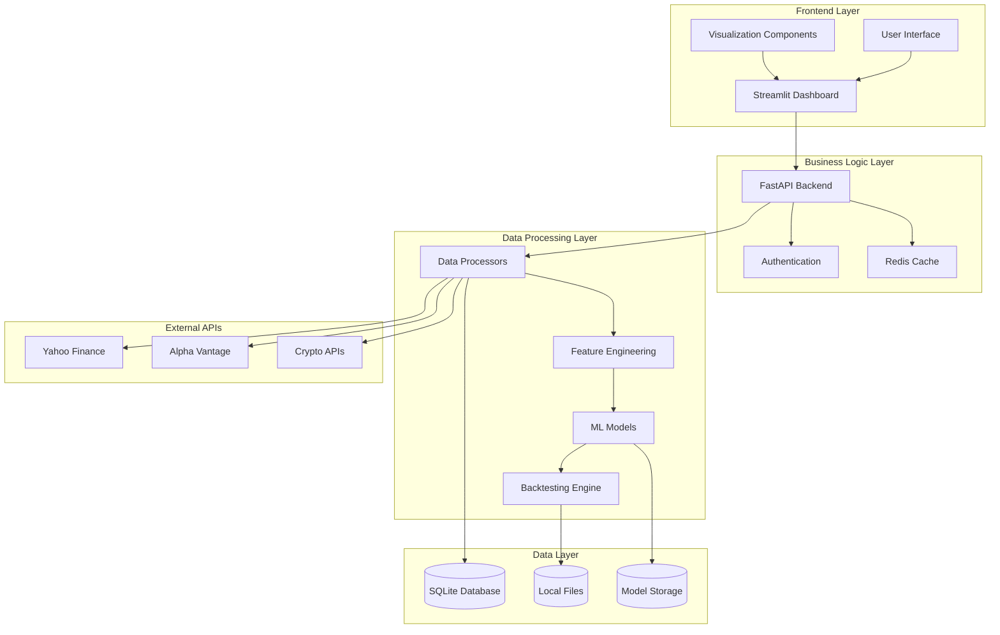

---

## 🔄 Feature Flow Diagram

### Main Analysis Workflow

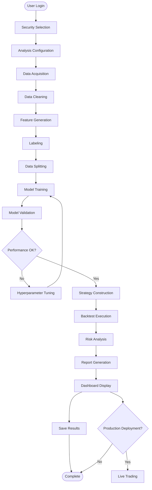

### Model Development Flow

```mermaid
flowchart LR
    subgraph "Data Preparation"
        D1[Raw Data] --> D2[Clean Data]
        D2 --> D3[Feature Engineering]
        D3 --> D4[Labeling]
    end
    
    subgraph "Model Development"
        M1[Model Selection] --> M2[Hyperparameter Tuning]
        M2 --> M3[Training]
        M3 --> M4[Validation]
    end
    
    subgraph "Strategy Testing"
        S1[Strategy Definition] --> S2[Backtesting]
        S2 --> S3[Risk Analysis]
        S3 --> S4[Performance Metrics]
    end
    
    D4 --> M1
    M4 --> S1
    S4 --> DEPLOY[Deployment]
```

---

## 📊 Data Flow Diagram

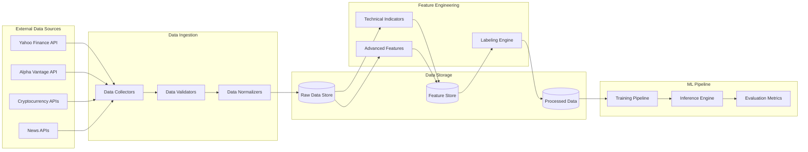

---

## 🎨 UI/UX Wireframes

### Main Dashboard

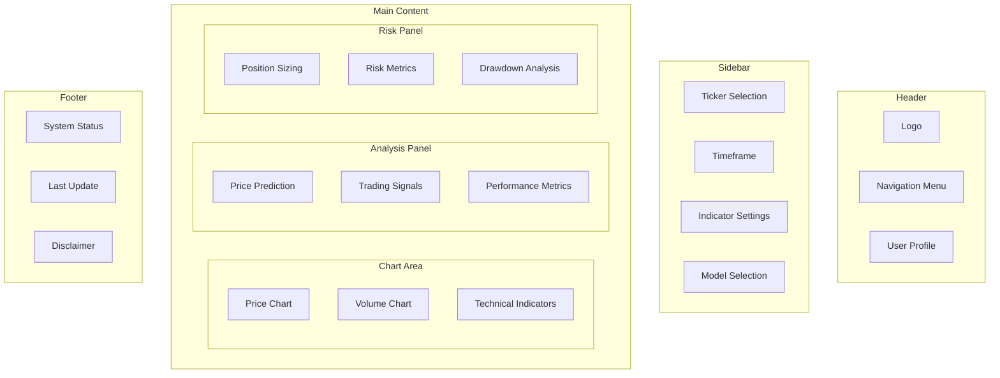

### Analysis Results Page

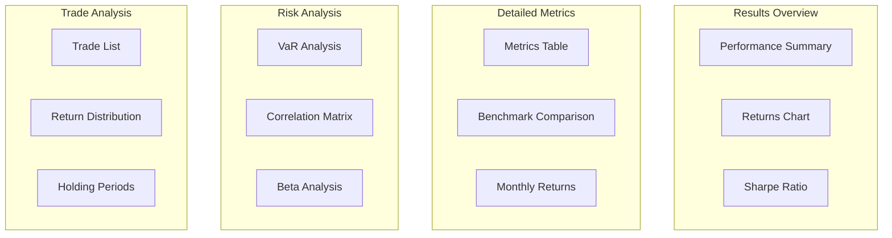

---

## 🛠 Technology Stack Details

### Frontend Technology Configuration

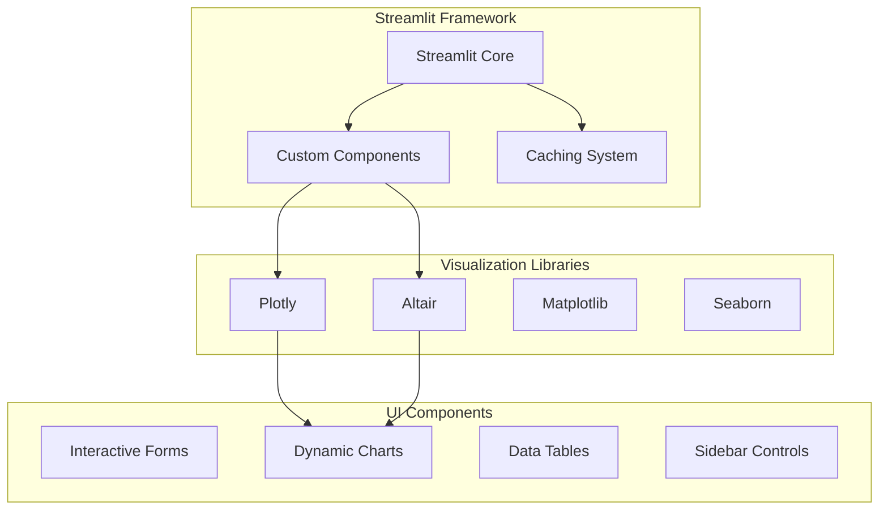

### Backend Technology Configuration

```mermaid
graph TB
    subgraph "Core Python Stack"
        PYTHON[Python 3.9+]
        PANDAS[Pandas]
        NUMPY[NumPy]
        SCIPY[SciPy]
    end
    
    subgraph "Machine Learning (Traditional ✅)"
        SKLEARN[Scikit-learn]
        XGBOOST[XGBoost 2.0+]
        JOBLIB[Joblib Persistence]
    end
    
    subgraph "Deep Learning (Planned)"
        TF[TensorFlow/Keras]
        PYTORCH[PyTorch]
    end
    
    subgraph "Financial Libraries"
        TALIB[TA-Lib]
        BACKTRADER[Backtrader]
        ZIPLINE[Zipline]
        QUANTLIB[QuantLib]
    end
    
    subgraph "Data Sources"
        YFINANCE[yfinance (Primary)]
        PANDAS_DR[pandas-datareader]
        CCXT[ccxt]
        ALPHA_VANTAGE[Alpha Vantage]
    end
    
    PYTHON --> PANDAS
    PYTHON --> NUMPY
    PANDAS --> SKLEARN
    SKLEARN --> XGBOOST
    NUMPY --> TF
    PANDAS --> TALIB
    TALIB --> BACKTRADER
```

---

## 🚀 Deployment Configuration

### Local Development Environment

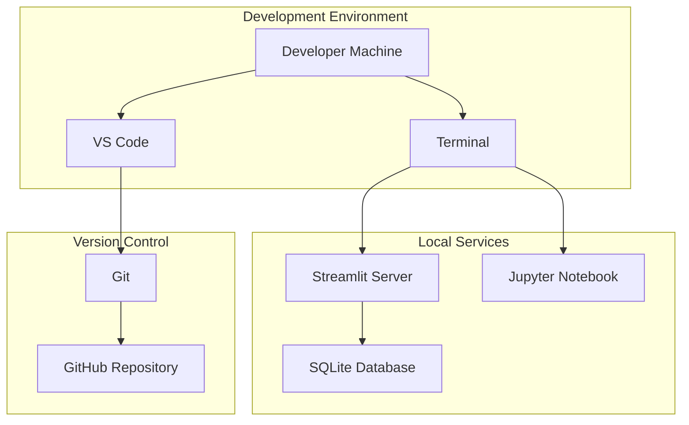

### Production Environment (Future)

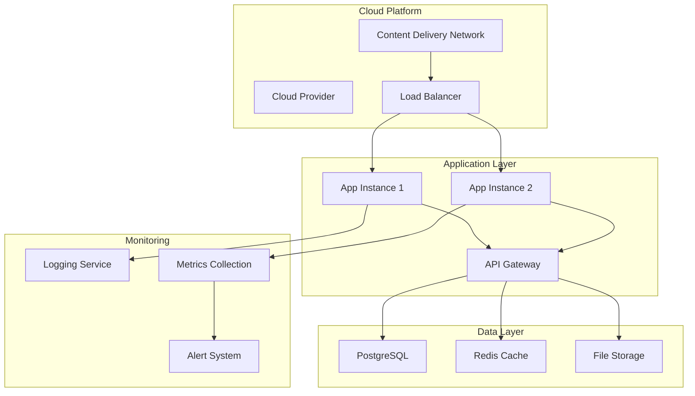

---

## 🔒 Security Architecture

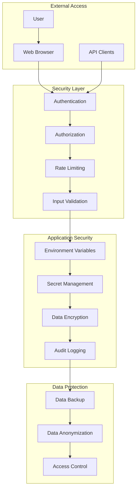

---

## 📐 Database Design

### Main Table Configuration

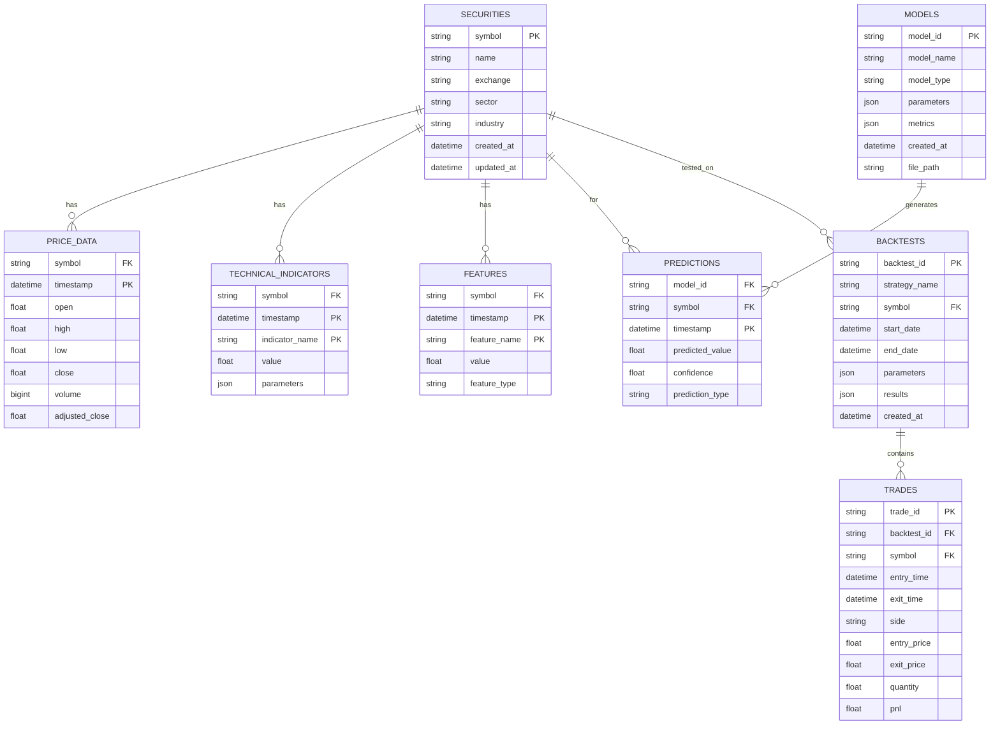

---

## 🎯 Performance Optimization

### Cache Strategy

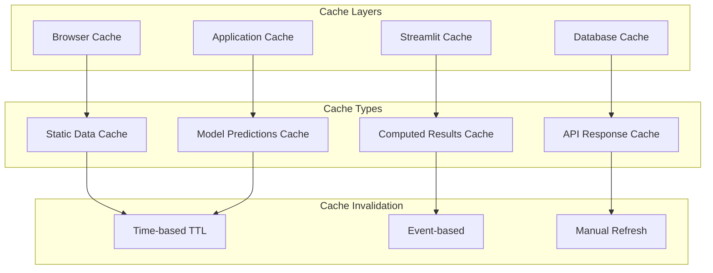

### Computational Optimization

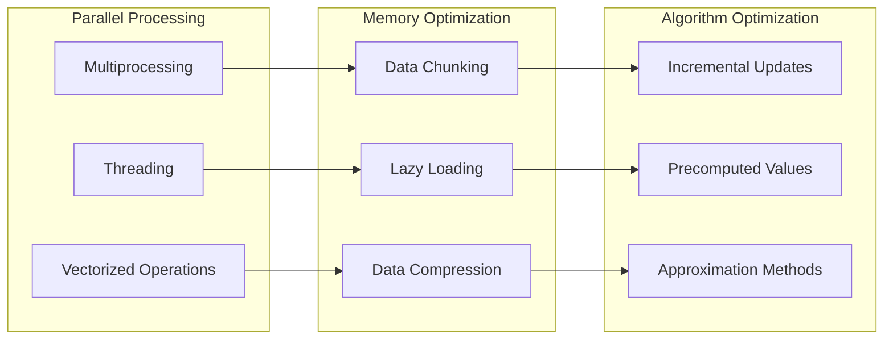

---

## 📊 Monitoring & Analysis

### System Metrics

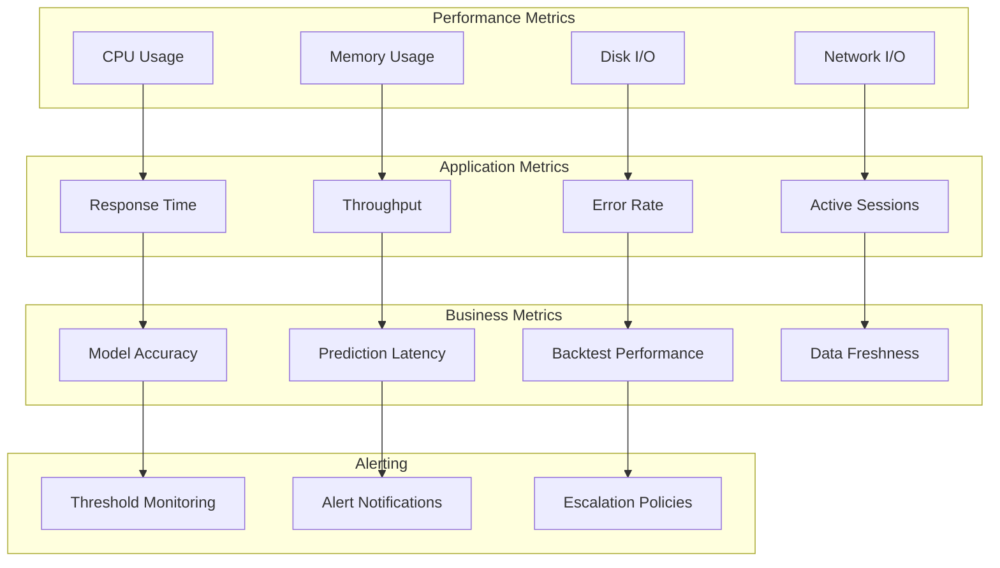

---

This architecture and visual reference document provides comprehensive visual documentation of the system design, implementation approach, and development workflows. It serves as the technical blueprint for implementation decisions and system understanding.

## 🔄 Implementation Workflow

### Development Workflow

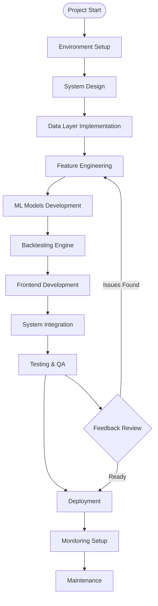

### Code Review Process

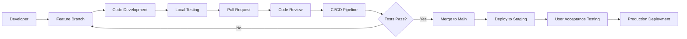

## 🏗 Detailed System Components

### Data Processing Architecture

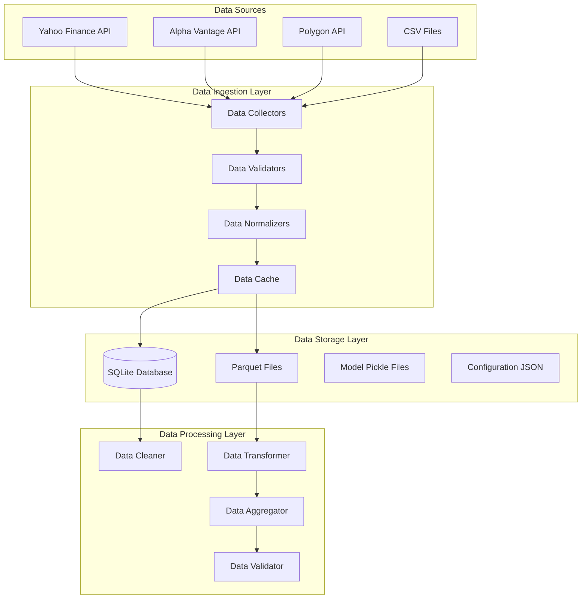

### Feature Engineering Pipeline

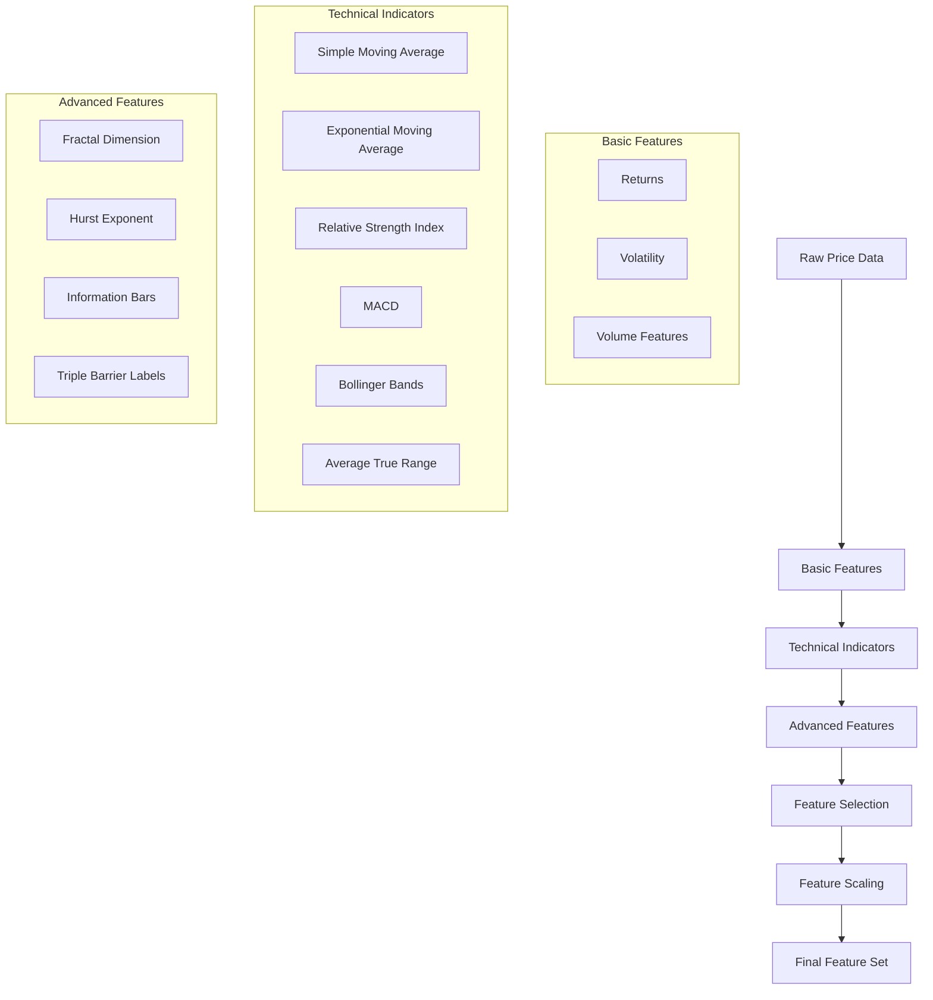

### Machine Learning Pipeline

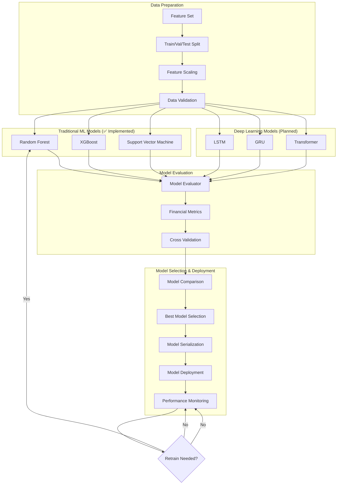

## 🔧 Technical Implementation Details

### Class Hierarchy Design

```mermaid
classDiagram
    class BaseDataCollector {
        +fetch_data(symbol, start, end)
        +validate_data(data)
        +normalize_data(data)
        +handle_errors(error)
    }
    
    class YFinanceCollector {
        +api_client: yfinance
        +rate_limiter: RateLimiter
        +fetch_stock_data()
        +fetch_options_data()
    }
    
    class AlphaVantageCollector {
        +api_key: str
        +base_url: str
        +fetch_intraday_data()
        +fetch_fundamental_data()
    }
    
    class FeatureEngineering {
        +technical_indicators: TechnicalIndicators
        +advanced_features: AdvancedFeatures
        +generate_features()
        +select_features()
    }
    
    class TechnicalIndicators {
        +sma(data, window)
        +ema(data, window)
        +rsi(data, window)
        +macd(data, fast, slow, signal)
        +bollinger_bands(data, window, std)
    }
    
    class BaseModel {
        +train(features, targets)
        +predict(features)
        +evaluate(test_data)
        +save_model(path)
        +load_model(path)
        +get_feature_importance()
    }
    
    class BaseClassifier {
        +predict_proba(features)
        +classification_report()
    }
    
    class BaseRegressor {
        +predict_intervals(features)
        +regression_metrics()
    }
    
    class QuantRandomForestClassifier {
        +n_estimators: int
        +class_weight: str
        +get_feature_importance()
        +plot_feature_importance()
    }
    
    class QuantRandomForestRegressor {
        +predict_quantiles(features)
        +estimate_uncertainty()
    }
    
    class QuantXGBoostClassifier {
        +learning_rate: float
        +early_stopping: bool
        +gpu_acceleration: bool
    }
    
    class QuantXGBoostRegressor {
        +objective: str
        +regularization: dict
    }
    
    class QuantSVMClassifier {
        +kernel: str
        +probability: bool
        +plot_decision_boundary()
    }
    
    class QuantSVMRegressor {
        +epsilon: float
        +kernel_params: dict
    }
    
    class ModelEvaluator {
        +evaluate_model(model, data)
        +compare_models(models)
        +financial_metrics()
    }
    
    class CrossValidator {
        +time_series_split()
        +purged_cv()
    }
    
    class LSTMModel {
        +sequence_length: int
        +layers: list
        +build_model()
        +compile_model()
    }
    
    class BacktestEngine {
        +initial_capital: float
        +positions: dict
        +trade_history: list
        +run_backtest()
        +calculate_metrics()
    }
    
    BaseDataCollector <|-- YFinanceCollector
    BaseDataCollector <|-- AlphaVantageCollector
    
    BaseModel <|-- BaseClassifier
    BaseModel <|-- BaseRegressor
    
    BaseClassifier <|-- QuantRandomForestClassifier
    BaseClassifier <|-- QuantXGBoostClassifier
    BaseClassifier <|-- QuantSVMClassifier
    
    BaseRegressor <|-- QuantRandomForestRegressor
    BaseRegressor <|-- QuantXGBoostRegressor
    BaseRegressor <|-- QuantSVMRegressor
    
    BaseModel <|-- LSTMModel
    
    FeatureEngineering --> TechnicalIndicators
    BaseModel --> ModelEvaluator
    ModelEvaluator --> CrossValidator
```

### Database Schema Design

```mermaid
erDiagram
    SECURITIES {
        string symbol PK
        string name
        string exchange
        string sector
        string industry
        string market_cap
        datetime created_at
        datetime updated_at
        boolean is_active
    }
    
    PRICE_DATA {
        string symbol FK
        datetime timestamp PK
        float open
        float high
        float low
        float close
        bigint volume
        float adjusted_close
        float split_ratio
        float dividend_amount
        datetime created_at
    }
    
    TECHNICAL_INDICATORS {
        string symbol FK
        datetime timestamp PK
        string indicator_name PK
        float value
        json parameters
        string timeframe
        datetime calculated_at
    }
    
    FEATURES {
        string symbol FK
        datetime timestamp PK
        string feature_name PK
        float value
        string feature_type
        string category
        float importance_score
        datetime created_at
    }
    
    MODELS {
        string model_id PK
        string model_name
        string model_type
        string model_version
        json parameters
        json metrics
        string file_path
        string status
        datetime created_at
        datetime last_trained
    }
    
    PREDICTIONS {
        string prediction_id PK
        string model_id FK
        string symbol FK
        datetime timestamp PK
        datetime prediction_for
        float predicted_value
        float confidence
        string prediction_type
        json features_used
        datetime created_at
    }
    
    BACKTESTS {
        string backtest_id PK
        string strategy_name
        string model_id FK
        string symbol FK
        datetime start_date
        datetime end_date
        float initial_capital
        json parameters
        json results
        string status
        datetime created_at
        datetime completed_at
    }
    
    TRADES {
        string trade_id PK
        string backtest_id FK
        string symbol FK
        datetime entry_time
        datetime exit_time
        string side
        float entry_price
        float exit_price
        float quantity
        float commission
        float slippage
        float pnl
        string trade_reason
        datetime created_at
    }
    
    PERFORMANCE_METRICS {
        string metric_id PK
        string backtest_id FK
        string metric_name
        float metric_value
        string metric_type
        datetime period_start
        datetime period_end
        datetime calculated_at
    }
    
    SECURITIES ||--o{ PRICE_DATA : "has"
    SECURITIES ||--o{ TECHNICAL_INDICATORS : "has"
    SECURITIES ||--o{ FEATURES : "has"
    MODELS ||--o{ PREDICTIONS : "generates"
    SECURITIES ||--o{ PREDICTIONS : "for"
    SECURITIES ||--o{ BACKTESTS : "tested_on"
    MODELS ||--o{ BACKTESTS : "uses"
    BACKTESTS ||--o{ TRADES : "contains"
    BACKTESTS ||--o{ PERFORMANCE_METRICS : "measured_by"
```

## 🚀 Deployment Architecture

### Development Environment

```mermaid
graph TB
    subgraph "Local Development"
        VSCODE[VS Code IDE]
        PYTHON[Python 3.9+]
        VENV[Virtual Environment]
        GIT[Git Repository]
    end
    
    subgraph "Local Services"
        STREAMLIT[Streamlit Server :8501]
        JUPYTER[Jupyter Notebook :8888]
        SQLITE[SQLite Database]
        REDIS[Redis Cache :6379]
    end
    
    subgraph "External APIs"
        YAHOO[Yahoo Finance API]
        ALPHA[Alpha Vantage API]
        POLYGON[Polygon API]
    end
    
    VSCODE --> PYTHON
    PYTHON --> VENV
    VENV --> STREAMLIT
    VENV --> JUPYTER
    
    STREAMLIT --> SQLITE
    STREAMLIT --> REDIS
    STREAMLIT --> YAHOO
    STREAMLIT --> ALPHA
    STREAMLIT --> POLYGON
    
    GIT --> GITHUB[GitHub Repository]
```

### Production Architecture (Future)

```mermaid
graph TB
    subgraph "Load Balancer Layer"
        LB[Load Balancer]
        CDN[Content Delivery Network]
    end
    
    subgraph "Application Layer"
        APP1[App Instance 1]
        APP2[App Instance 2]
        APP3[App Instance 3]
        API[API Gateway]
    end
    
    subgraph "Data Layer"
        POSTGRES[(PostgreSQL)]
        REDIS[(Redis Cluster)]
        S3[(Object Storage)]
        ELASTIC[Elasticsearch]
    end
    
    subgraph "ML Infrastructure"
        MLFLOW[MLflow Tracking]
        KUBEFLOW[Kubeflow Pipelines]
        AIRFLOW[Apache Airflow]
    end
    
    subgraph "Monitoring"
        PROMETHEUS[Prometheus]
        GRAFANA[Grafana]
        ALERTMANAGER[Alert Manager]
        JAEGER[Jaeger Tracing]
    end
    
    CDN --> LB
    LB --> APP1
    LB --> APP2
    LB --> APP3
    
    APP1 --> API
    APP2 --> API
    APP3 --> API
    
    API --> POSTGRES
    API --> REDIS
    API --> S3
    API --> ELASTIC
    
    APP1 --> MLFLOW
    APP2 --> KUBEFLOW
    APP3 --> AIRFLOW
    
    APP1 --> PROMETHEUS
    PROMETHEUS --> GRAFANA
    PROMETHEUS --> ALERTMANAGER
    APP1 --> JAEGER
```

## 🔍 Monitoring and Observability

### Application Monitoring

```mermaid
graph TB
    subgraph "Application Metrics"
        RESPONSE[Response Time]
        THROUGHPUT[Throughput]
        ERROR_RATE[Error Rate]
        ACTIVE_USERS[Active Users]
    end
    
    subgraph "System Metrics"
        CPU[CPU Usage]
        MEMORY[Memory Usage]
        DISK[Disk I/O]
        NETWORK[Network I/O]
    end
    
    subgraph "Business Metrics"
        MODEL_ACCURACY[Model Accuracy]
        PREDICTION_LATENCY[Prediction Latency]
        TRADE_PERFORMANCE[Trade Performance]
        DATA_QUALITY[Data Quality]
    end
    
    subgraph "Alerting"
        PROMETHEUS[Prometheus]
        ALERTMANAGER[Alert Manager]
        SLACK[Slack Notifications]
        EMAIL[Email Alerts]
    end
    
    RESPONSE --> PROMETHEUS
    CPU --> PROMETHEUS
    MODEL_ACCURACY --> PROMETHEUS
    
    PROMETHEUS --> ALERTMANAGER
    ALERTMANAGER --> SLACK
    ALERTMANAGER --> EMAIL
```

### Logging Architecture

```mermaid
graph LR
    subgraph "Application Logs"
        APP_LOGS[Application Logs]
        ERROR_LOGS[Error Logs]
        ACCESS_LOGS[Access Logs]
        AUDIT_LOGS[Audit Logs]
    end
    
    subgraph "Log Processing"
        FILEBEAT[Filebeat]
        LOGSTASH[Logstash]
        ELASTICSEARCH[Elasticsearch]
    end
    
    subgraph "Visualization"
        KIBANA[Kibana]
        GRAFANA[Grafana]
        ALERTS[Alert Rules]
    end
    
    APP_LOGS --> FILEBEAT
    ERROR_LOGS --> FILEBEAT
    ACCESS_LOGS --> FILEBEAT
    AUDIT_LOGS --> FILEBEAT
    
    FILEBEAT --> LOGSTASH
    LOGSTASH --> ELASTICSEARCH
    
    ELASTICSEARCH --> KIBANA
    ELASTICSEARCH --> GRAFANA
    ELASTICSEARCH --> ALERTS
```
