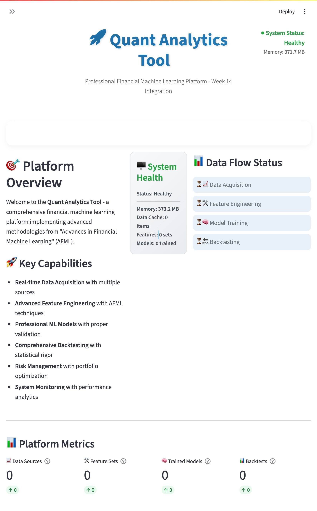
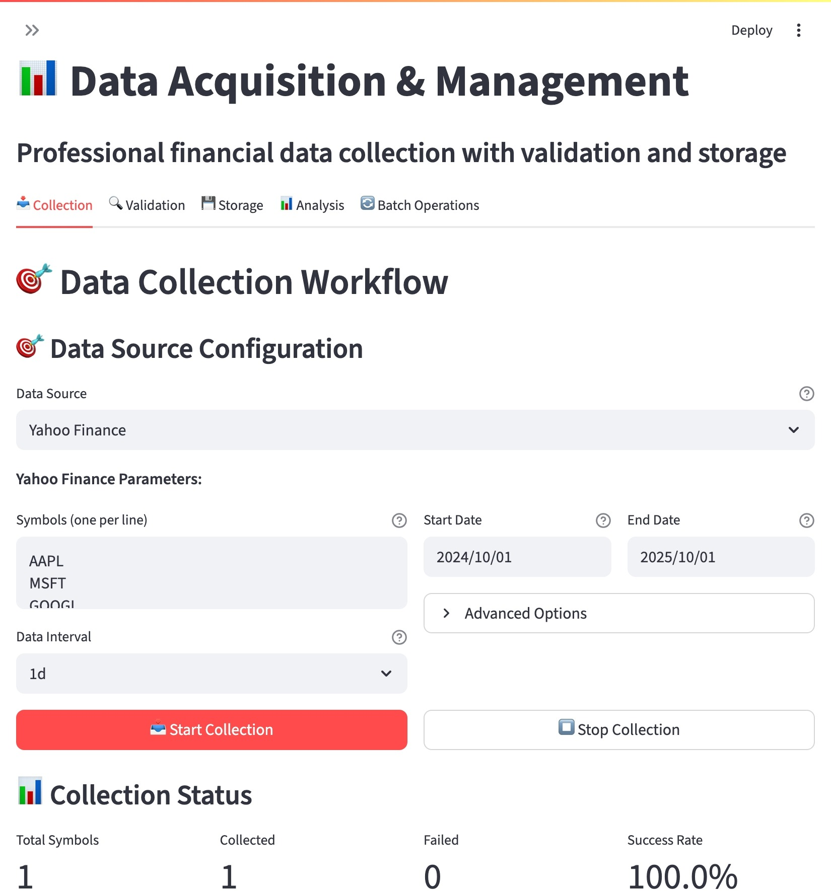
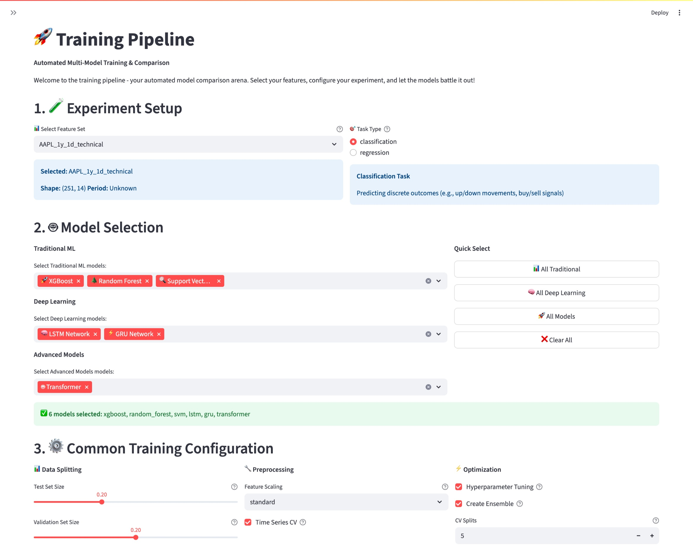
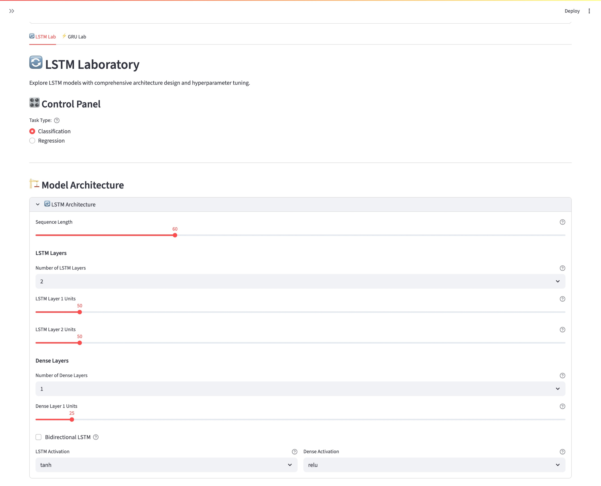
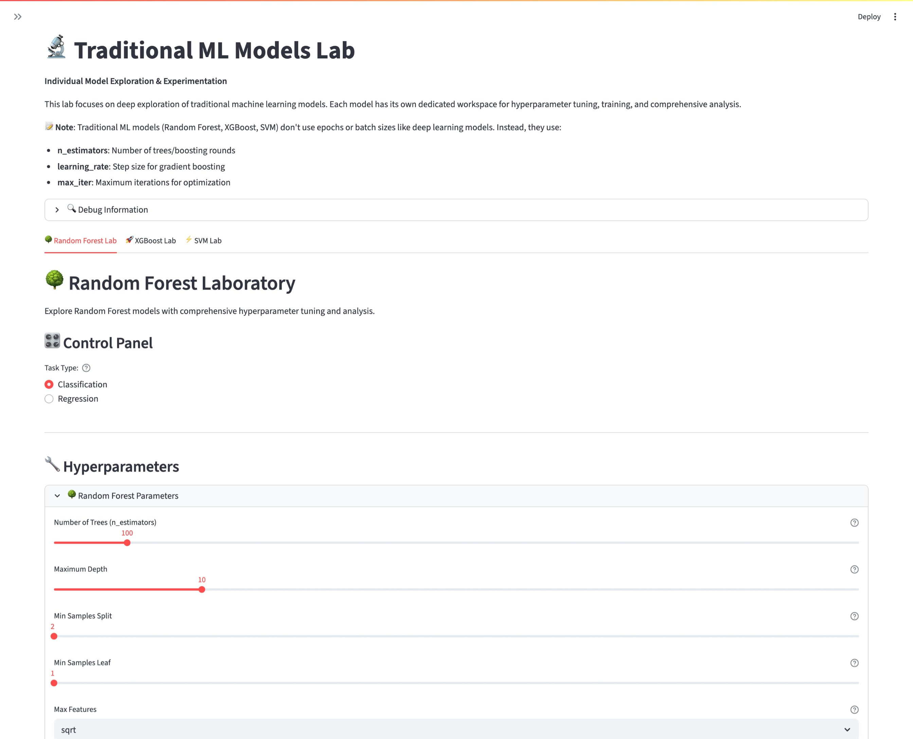
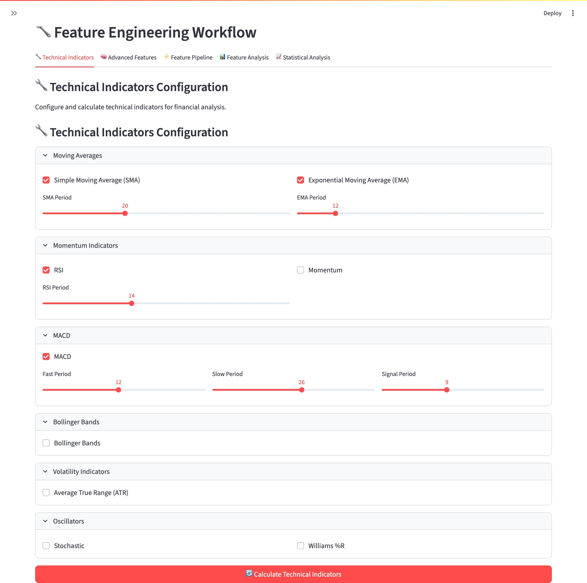
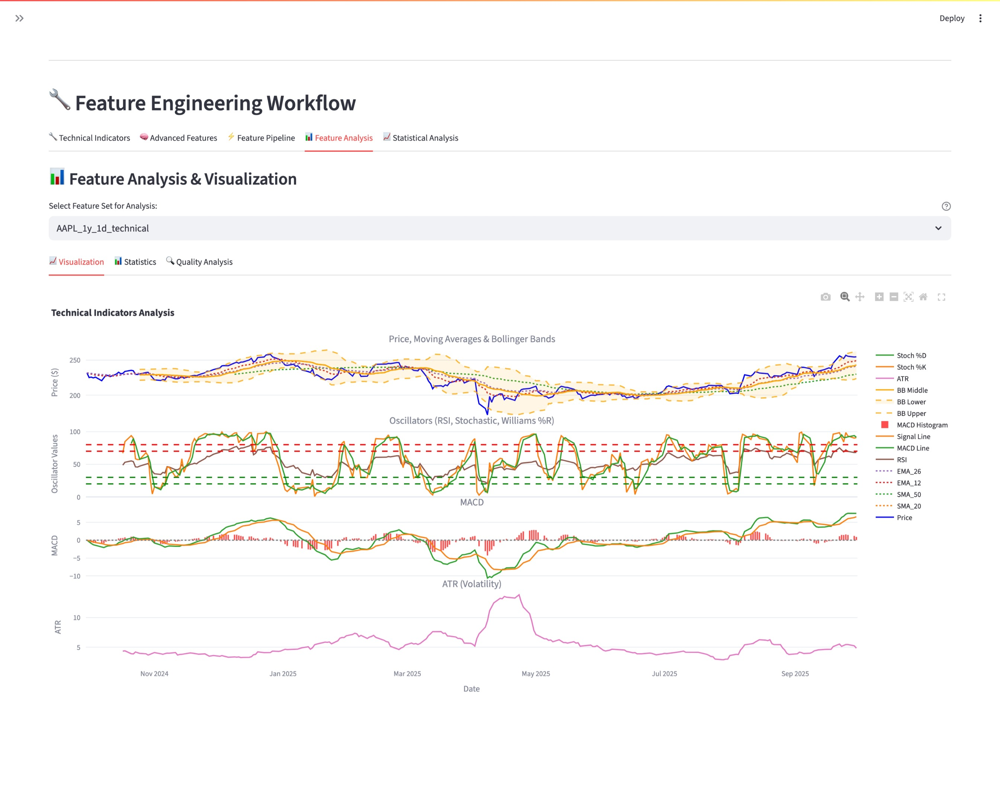
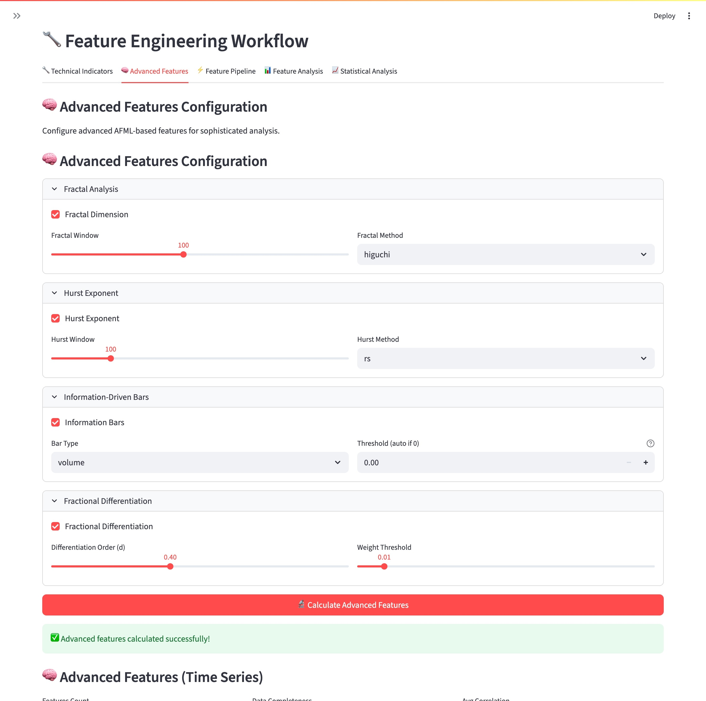
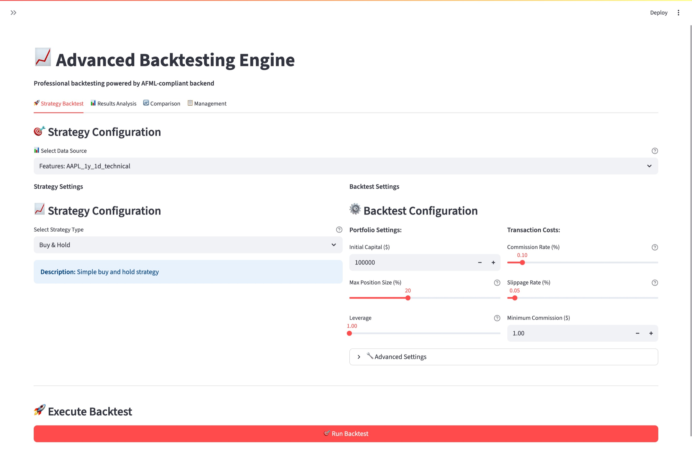
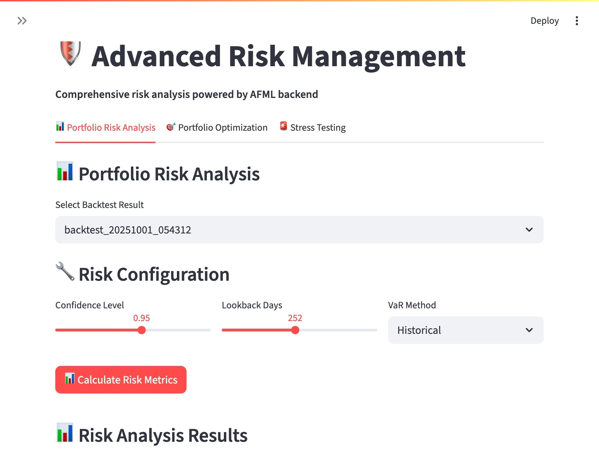

# Quant Analytics Tool

[](https://www.python.org/)
[](https://streamlit.io/)
[](LICENSE)
[]()

**A comprehensive prototype tool for quantitative financial data analysis and algorithmic trading**

This tool implements methodologies from "Advances in Financial Machine Learning" to provide integrated financial data analysis, strategy development, and backtesting capabilities using machine learning.



## Key Features

### Data Acquisition & Analysis
- **Multi-Source Data Integration**: Yahoo Finance, Alpha Vantage, Polygon APIs
- **Real-time Data Processing**: Live market data with <15 minute latency
- **Historical Data Management**: Comprehensive historical data storage and retrieval
- **Data Quality Assurance**: Automated validation, cleaning, and outlier detection
- **Multi-Asset Support**: Stocks, ETFs, FX, Cryptocurrencies, Options


### Advanced Machine Learning

- **MLOps Pipeline**: Complete end-to-end ML pipeline with automated training, versioning, deployment
  
  - Automated model training pipeline with AFML-compliant time-series cross-validation
  - Model registry with SQLite backend and staging→production workflow
  - Real-time prediction engine with TTL caching and ensemble predictions
  - Blue-Green & Canary deployment system with automatic rollback and health checks
  - Continuous model monitoring with data drift detection and real-time alerting
- **Advanced Models**: Transformer architecture, Multi-head Attention, Meta-labeling
- **Deep Learning Models**: LSTM, Bidirectional LSTM, GRU architectures
    
- **Ensemble Methods**: Random Forest, Bagging, Stacking, Voting Classifiers
- **Traditional ML**: Random Forest, XGBoost, Support Vector Machines
  
- **Model Interpretation**: SHAP analysis, Feature importance, Partial dependence
- **Model Framework**: Base classes, evaluation, cross-validation
- **Production Deployment**: Enterprise-grade MLOps platform with 108 comprehensive tests

### Sophisticated Feature Engineering
- **Technical Indicators**: Complete TA-Lib integration with custom indicators
  
  
- **Advanced Features**: Fractal dimension, Hurst exponent, information-driven bars
  
- **Meta-Labeling**: Triple barrier method from "Advances in Financial ML" 
- **Feature Selection**: Automated feature importance and selection algorithms
- **Feature Pipeline**: Automated feature generation and quality validation

### Comprehensive Backtesting

- **Strategy Framework**: Extensible strategy development framework 
- **Performance Analytics**: 20+ performance and risk metrics
- **Event-driven Engine**: AFML-compliant backtesting with time-series integrity
- **Portfolio Management**: Position tracking, cash management, risk controls
- **Trade Execution**: Realistic slippage, commission modeling, market impact

### Advanced Risk Management

- **Position Sizing**: Kelly criterion, risk parity, AFML bet sizing, volatility targeting
- **Risk Metrics**: VaR/CVaR (parametric, historical, Monte Carlo), maximum drawdown, portfolio risk analysis
- **Portfolio Optimization**: Modern Portfolio Theory, Black-Litterman, Hierarchical Risk Parity (HRP)
- **Stress Testing**: Monte Carlo simulation, scenario analysis, sensitivity testing, tail risk assessment
- **Comprehensive Framework**: 120 tests covering complete risk management system with AFML compliance

### Advanced Analysis
- **Walk-Forward Analysis**: Purged Group Time Series Split with AFML-compliant cross-validation
- **Monte Carlo Simulation**: Bootstrap analysis, synthetic data generation, multi-scenario probabilistic analysis
- **Sensitivity Analysis**: Parameter robustness testing, feature importance analysis, Greeks calculation
- **Advanced Stress Testing**: Binary strategy testing, extreme event simulation, liquidity stress analysis
- **Performance Attribution**: Brinson attribution, factor-based decomposition, risk-based attribution
- **Integrated Platform**: Unified analysis framework with 153 comprehensive tests and complete AFML compliance

### Interactive Dashboard - Currently being implemented
- **Real-time Visualization**: Live updating charts and metrics
- **Customizable Interface**: Drag-and-drop dashboard configuration
- **Export Capabilities**: PDF reports, CSV data export, chart saving
- **Mobile Responsive**: Optimized for desktop, tablet, and mobile devices
- **Multi-language Support**: English interface with Japanese market support

## Technology Stack

### Frontend
- **Streamlit**: Main dashboard
- **Plotly**: Interactive visualization
- **Altair**: Statistical visualization

### Backend & Data Processing
- **Python 3.9+**: Main development language
- **Pandas / NumPy**: Data manipulation & numerical computation
- **Scikit-learn**: Machine learning
- **TensorFlow/Keras**: Deep learning
- **TA-Lib**: Technical analysis
- **SQLite**: Local database

### Data Sources
- **yfinance**: Yahoo Finance API
- **pandas-datareader**: Various financial data sources
- **ccxt**: Cryptocurrency exchange APIs

### Backtesting
- **Backtrader**: Backtesting engine
- **Zipline**: Algorithmic trading framework

## 🚀 Quick Start

### Prerequisites
- **Python 3.9+** (recommended: Python 3.11)
- **Git** for version control
- **8GB RAM** minimum (16GB+ recommended)
- **10GB free disk space** for data and models

### 1. Environment Setup

```bash
# Clone repository
git clone https://github.com/yf591/quant-analytics-tool.git
cd quant-analytics-tool

# Create Python virtual environment
python -m venv venv

# Activate virtual environment
source venv/bin/activate  # macOS/Linux
# venv\Scripts\activate   # Windows

# Upgrade pip and install dependencies
pip install --upgrade pip
pip install -r requirements.txt

# Install additional dependencies for development
pip install -r requirements-dev.txt  # Optional: for development tools
```

### 2. Configuration Setup

```bash
# Copy environment template
cp .env.example .env

# Edit configuration file
nano .env  # or use your preferred editor
```

#### Environment Variables Configuration
```bash
# Application Settings
DEBUG=false
LOG_LEVEL=INFO

# Data Source API Keys (optional for basic functionality)
ALPHA_VANTAGE_API_KEY=your_api_key_here
QUANDL_API_KEY=your_api_key_here
POLYGON_API_KEY=your_api_key_here

# Database Configuration
DATABASE_URL=sqlite:///./data/quant_analytics.db

# Cache Settings
CACHE_TTL=3600
REDIS_URL=redis://localhost:6379/0  # Optional: for advanced caching

# Security
SECRET_KEY=generate-a-strong-secret-key-here
```

### 3. Initial Data Setup

```bash
# Create necessary directories
mkdir -p data/raw data/processed models logs

# Initialize database
python scripts/init_database.py

# Download sample data (optional)
python scripts/download_sample_data.py
```

### 4. Launch Application

```bash
# Start Streamlit dashboard
streamlit run streamlit_app/main.py

# Alternative: Start with specific configuration
streamlit run streamlit_app/main.py --server.port=8501
```

Access the application at `http://localhost:8501`

### 5. Quick Tutorial

#### Basic Data Analysis Workflow:
1. **Navigate to Data Acquisition**: Select your preferred data source
2. **Choose Securities**: Enter stock symbols (e.g., AAPL, GOOGL, TSLA)
3. **Set Date Range**: Choose analysis period
4. **Generate Features**: Enable technical indicators and advanced features
5. **Train Models**: Select ML model type and train
6. **Run Backtest**: Evaluate strategy performance
7. **Analyze Results**: Review metrics and visualizations

#### Example: Quick S&P 500 Analysis
```python
# In the Streamlit interface:
# 1. Data Source: Yahoo Finance
# 2. Symbol: SPY
# 3. Date Range: 2020-01-01 to 2023-12-31
# 4. Features: Enable SMA, RSI, MACD
# 5. Model: LSTM
# 6. Strategy: Mean Reversion
```

## 📁 Project Structure

```
quant-analytics-tool/
├── 📁 src/                         # Main source code
│   ├── 📁 data/                   # Data acquisition & processing
│   │   ├── collectors.py          # Data source collectors
│   │   ├── processors.py          # Data cleaning and preprocessing
│   │   ├── validators.py          # Data quality validation
│   │   └── storage.py             # Data storage management
│   ├── 📁 features/               # Feature engineering
│   │   ├── technical.py           # Technical indicators
│   │   ├── advanced.py            # Advanced financial features
│   │   ├── labeling.py            # Meta-labeling methods
│   │   └── pipeline.py            # Feature generation pipeline
│   ├── 📁 models/                 # Machine learning models
│   │   ├── base.py                # Base model classes
│   │   ├── evaluation.py          # Model evaluation
│   │   ├── traditional/           # Traditional ML models
│   │   │   ├── __init__.py
│   │   │   ├── random_forest.py   # Random Forest
│   │   │   ├── svm_model.py       # Support Vector Machine
│   │   │   └── xgboost_model.py   # XGBoost
│   │   ├── deep_learning/         # Deep learning models
│   │   │   ├── __init__.py        # Package initialization
│   │   │   ├── lstm.py            # LSTM implementations
│   │   │   ├── gru.py             # GRU implementations
│   │   │   └── utils.py           # Deep learning utilities
│   │   ├── advanced/              # Advanced models
│   │   │   ├── __init__.py        # Package initialization
│   │   │   ├── transformer.py     # Transformer architecture
│   │   │   ├── attention.py       # Attention mechanisms
│   │   │   ├── ensemble.py        # Ensemble methods
│   │   │   ├── meta_labeling.py   # Meta-labeling techniques
│   │   │   └── interpretation.py  # Model interpretation tools
│   │   └── 📁 pipeline/           # ML Pipeline System
│   │       ├── __init__.py        # Package initialization
│   │       ├── training_pipeline.py # Automated model training
│   │       ├── model_registry.py  # Model versioning & lifecycle
│   │       ├── prediction.py      # Real-time prediction engine
│   │       ├── deployment.py      # Blue-Green & Canary deployment
│   │       └── monitoring.py      # Model monitoring & alerts
│   ├── 📁 analysis/               # Analysis framework
│   │   ├── __init__.py            # Package initialization with exports
│   │   ├── returns.py             # Return analysis and calculations
│   │   ├── volatility.py          # Volatility modeling and estimation
│   │   ├── statistics.py          # Statistical analysis and metrics
│   │   ├── correlation.py         # Correlation and dependency analysis
│   │   ├── walk_forward.py        # Walk-forward analysis
│   │   ├── monte_carlo.py         # Monte Carlo simulation
│   │   ├── sensitivity.py         # Sensitivity analysis
│   │   ├── stress_testing.py      # Advanced stress testing
│   │   └── performance_attribution.py # Performance attribution
│   ├── 📁 backtesting/            # Backtesting framework
│   │   ├── __init__.py            # Package integration export
│   │   ├── engine.py              # Event-driven backtesting engine
│   │   ├── strategies.py          # Trading strategies framework
│   │   ├── metrics.py             # AFML performance metrics
│   │   ├── portfolio.py           # Portfolio management
│   │   └── execution.py           # Trade execution simulation
│   ├── 📁 risk/                   # Risk management
│   │   ├── position_sizing.py     # Position sizing algorithms (Kelly, Risk Parity, AFML)
│   │   ├── risk_metrics.py        # Risk calculations (VaR, CVaR, drawdown analysis)
│   │   ├── portfolio_optimization.py # Portfolio optimization (MPT, Black-Litterman, HRP)
│   │   └── stress_testing.py      # Stress testing (Monte Carlo, scenario analysis)
│   ├── 📁 visualization/          # Visualization components
│   │   ├── charts.py              # Chart generation
│   │   ├── dashboards.py          # Dashboard components
│   │   ├── reports.py             # Report generation
│   │   └── utils.py               # Visualization utilities
│   ├── 📁 utils/                  # Utility functions
│   │   ├── logging.py             # Logging configuration
│   │   ├── helpers.py             # Helper functions
│   │   └── decorators.py          # Custom decorators
│   └── config.py                  # Configuration management
├── 📁 streamlit_app/              # Streamlit application
│   ├── 📁 pages/                  # Streamlit pages
│   │   ├── 01_data_acquisition.py # Data acquisition page
│   │   ├── 02_feature_engineering.py # Feature engineering page
│   │   ├── 03_a_traditional_models.py # Traditional ML models page
│   │   ├── 03_b_deep_learning_models.py # Deep learning models page
│   │   ├── 03_c_advanced_models.py # Advanced models page
│   │   ├── 03_model_training.py   # Model training page
│   │   ├── 04_Training_Pipeline.py # Training pipeline page
│   │   ├── 05_backtesting.py      # Backtesting page
│   │   └── 06_risk_management.py  # Risk management page
│   ├── 📁 components/             # Reusable UI components
│   │   ├── __init__.py            # Package initialization
│   │   ├── backtest_widgets.py    # Backtesting widgets
│   │   ├── charts.py              # Chart components
│   │   ├── data_display.py        # Data display components
│   │   ├── data_management.py     # Data management widgets
│   │   ├── forms.py               # Form components
│   │   └── model_widgets.py       # Model widgets
│   ├── 📁 utils/                  # Streamlit utilities
│   │   ├── __init__.py            # Package initialization
│   │   ├── advanced_models_manager.py # Advanced models management
│   │   ├── analysis_utils.py      # Analysis utilities
│   │   ├── backtest_utils.py      # Backtesting utilities
│   │   ├── data_utils.py          # Data utilities
│   │   ├── deep_learning_manager.py # Deep learning model manager
│   │   ├── feature_utils.py       # Feature engineering utilities
│   │   ├── model_utils.py         # Model utilities
│   │   ├── pipeline_utils.py      # Pipeline utilities
│   │   └── simple_model_manager.py # Simple model manager
│   ├── 📁 utils_pages/            # Page utilities
│   │   ├── cache_management.py    # Cache management
│   │   ├── data_explorer.py       # Data exploration utilities
│   │   ├── documentation.py       # Documentation helpers
│   │   └── settings.py            # Settings management
│   └── main.py                    # Main application entry
├── 📁 tests/                      # Test suite
│   ├── conftest.py                # Pytest configuration
│   ├── test_collectors.py         # Data collector tests
│   ├── test_feature_pipeline.py   # Feature pipeline tests
│   ├── 📁 analysis/               # Analysis module tests
│   │   ├── __init__.py            # Package initialization
│   │   ├── test_returns.py        # Return analysis tests (15 tests)
│   │   ├── test_volatility.py     # Volatility analysis tests (10 tests)
│   │   ├── test_statistics.py     # Statistical analysis tests (9 tests)
│   │   ├── test_correlation.py    # Correlation analysis tests (10 tests)
│   │   ├── test_walk_forward.py   # Walk-forward analysis tests (22 tests)
│   │   ├── test_monte_carlo.py    # Monte Carlo simulation tests (21 tests)
│   │   ├── test_sensitivity.py    # Sensitivity analysis tests (20 tests)
│   │   ├── test_stress_testing.py # Stress testing tests (23 tests)
│   │   └── test_performance_attribution.py # Performance attribution tests (23 tests)
│   ├── 📁 features/               # Feature engineering tests
│   └── 📁 models/                 # ML model tests
│       ├── test_traditional_models.py    # Traditional ML tests (Week 7)
│       ├── 📁 deep_learning/             # Deep learning model tests (Week 8)
│       │   ├── __init__.py               # Package initialization
│       │   ├── test_lstm_gru.py          # LSTM/GRU model tests
│       │   └── test_utils.py             # Deep learning utility tests
│       ├── 📁 advanced/                  # Advanced model tests (Week 9)
│       │   ├── __init__.py               # Package initialization
│       │   ├── test_transformer.py       # Transformer model tests
│       │   ├── test_attention.py         # Attention mechanism tests
│       │   ├── test_ensemble.py          # Ensemble method tests
│       │   ├── test_meta_labeling.py     # Meta-labeling tests
│       │   └── test_interpretation.py    # Model interpretation tests
│       └── 📁 pipeline/                  # ML Pipeline tests (Week 10)
│           ├── __init__.py               # Package initialization
│           ├── test_training_pipeline.py # Training pipeline tests
│           ├── test_model_registry.py    # Model registry tests
│           ├── test_prediction.py        # Prediction engine tests
│           ├── test_deployment.py        # Deployment system tests
│           └── test_monitoring.py        # Monitoring system tests
│   ├── 📁 backtesting/                   # Backtesting tests (Week 11)
│   │   ├── __init__.py                   # Package initialization
│   │   ├── test_backtest_engine.py       # Backtesting engine tests (26 tests)
│   │   ├── test_strategies.py            # Strategy framework tests (22 tests)
│   │   ├── test_performance_calculator.py # Performance calculator tests (37 tests)
│   │   ├── test_portfolio.py             # Portfolio management tests (30 tests)
│   │   └── test_execution_simulator.py   # Execution simulator tests (32 tests)
│   └── 📁 risk/                          # Risk management tests (Week 12)
│       ├── __init__.py                   # Package initialization
│       ├── test_position_sizing.py       # Position sizing tests (24 tests)
│       ├── test_risk_metrics.py          # Risk metrics tests (34 tests)
│       ├── test_portfolio_optimization.py # Portfolio optimization tests (31 tests)
│       └── test_stress_testing.py        # Stress testing tests (31 tests)
├── 📁 scripts/                    # Utility scripts
│   ├── init_database.py           # Database initialization
│   ├── download_sample_data.py    # Sample data download
│   ├── train_models.py            # Batch model training
│   └── generate_report.py         # Report generation
├── 📁 docs/                       # Documentation
│   ├── api/                       # API documentation
│   ├── tutorials/                 # User tutorials
│   └── developer_guide.md         # Developer guide
├── 📁 data/                       # Local data storage
│   ├── 📁 raw/                    # Raw data files
│   ├── 📁 processed/              # Processed data
│   └── 📁 external/               # External datasets
├── 📁 models/                     # Saved ML models
│   ├── 📁 trained/                # Trained models
│   ├── 📁 checkpoints/            # Training checkpoints
│   └── 📁 configs/                # Model configurations
├── 📁 logs/                       # Application logs
├── 📁 configs/                    # Configuration files
├── 📄 requirements.txt            # Production dependencies
├── 📄 requirements-dev.txt        # Development dependencies
├── 📄 .env.example                # Environment template
├── 📄 .gitignore                  # Git ignore rules
├── 📄 README.md                   # Project documentation
├── 📄 SPECIFICATION.md            # Technical specifications
├── 📄 Architecture_&_Visual_Reference.md # Architecture documentation
└── 📄 LICENSE                     # MIT License
```

### Key Directories Explained

#### `/src/` - Core Application Logic
- **data/**: Data acquisition, processing, and storage
- **features/**: Feature engineering and technical analysis
- **models/**: Machine learning model implementations
- **backtesting/**: Strategy testing and performance evaluation
- **risk/**: Risk management and portfolio optimization
- **visualization/**: Charts, dashboards, and reporting

#### `/streamlit_app/` - User Interface
- **pages/**: Individual dashboard pages
- **components/**: Reusable UI components
- **utils/**: UI-specific utilities and helpers

#### `/tests/` - Quality Assurance
- **unit/**: Individual component testing
- **integration/**: End-to-end workflow testing
- **fixtures/**: Test data and mock objects

#### `/scripts/` - Automation & Utilities
- Database setup and maintenance
- Data download and preprocessing
- Batch model training
- Report generation

## 💡 Planned Features

### 📊 Phase 1: Foundation (Weeks 1-3) ✅ **COMPLETED**
- [x] **Project Setup**: Complete infrastructure and configuration
- [x] **Data Acquisition**: Yahoo Finance integration with yFinance
- [x] **Data Validation**: Comprehensive data quality validation system
- [x] **Data Storage**: Local SQLite database with optimized performance
- [x] **Basic Analysis**: AFML-compliant return, volatility, statistical, and correlation analysis
- [x] **Logging System**: Comprehensive logging with rotation and level management
- [x] **Testing Framework**: Unit testing with pytest and comprehensive test coverage

**Key Achievements**:
- ✅ Complete data acquisition pipeline (YFinanceCollector)
- ✅ Advanced data validation (DataValidator with 3-tier validation)
- ✅ Optimized SQLite storage (SQLiteStorage with WAL mode)
- ✅ Four core analysis modules (returns, volatility, statistics, correlation)
- ✅ Risk metrics (VaR, CVaR, Sharpe, Sortino, Calmar ratios)
- ✅ Distribution analysis (normality, autocorrelation, ARCH tests)
- ✅ Comprehensive error handling and performance optimization

### 🧠 Phase 2: Feature Engineering (Weeks 4-6) ✅ **COMPLETED**
- [x] **Technical Indicators**: Core indicators (SMA, EMA, RSI, MACD, Bollinger Bands) ✅ **COMPLETED**
- [x] **Advanced Features**: Fractal dimension, Hurst exponent, information-driven bars ✅ **COMPLETED**
- [x] **Meta-Labeling**: Triple barrier method from "Advances in Financial ML" ✅ **COMPLETED**
- [x] **Fractional Differentiation**: Stationarity with memory preservation ✅ **COMPLETED**
- [x] **Feature Pipeline**: Automated feature generation and selection ✅ **COMPLETED**
- [x] **Feature Validation**: Quality checks and importance analysis ✅ **COMPLETED**

**Week 4 Achievements**:
- ✅ 10+ professional technical indicators implemented
- ✅ Comprehensive test suite (26 test cases, 100% pass rate)
- ✅ AFML-compliant calculations with error handling
- ✅ Real-time analysis capabilities and signal generation

**Week 5 Achievements**:
- ✅ Fractal dimension analysis (Higuchi & Box-counting methods)
- ✅ Hurst exponent calculation (R/S Analysis & DFA) for market regime identification
- ✅ Information-driven bars (Tick, Volume, Dollar bars) for superior data sampling
- ✅ Triple barrier method for sophisticated meta-labeling in ML
- ✅ Fractional differentiation for achieving stationarity while preserving memory
- ✅ 21 comprehensive test cases with full coverage of advanced features

### 🤖 Phase 3: Machine Learning Models (Weeks 7-10) ✅ **COMPLETED**
- [x] **Traditional ML**: Random Forest, XGBoost, Support Vector Machines ✅ **Week 7 COMPLETED**
- [x] **Deep Learning**: LSTM, Bidirectional LSTM, GRU architectures ✅ **Week 8 COMPLETED**
- [x] **Advanced Models**: Transformer architecture, Attention mechanisms, Ensemble methods ✅ **Week 9 COMPLETED**
- [x] **Meta-labeling**: Triple barrier labeling and position sizing ✅ **Week 9 COMPLETED**
- [x] **Model Interpretation**: SHAP analysis, feature importance, partial dependence plots ✅ **Week 9 COMPLETED**
- [x] **Model Pipeline**: Complete end-to-end ML pipeline with automated training, versioning, deployment ✅ **Week 10 COMPLETED**
- [x] **Model Evaluation**: Comprehensive comparison and validation framework ✅ **Week 7 COMPLETED**

**Week 7 Achievements**:
- ✅ Random Forest Classifier & Regressor with quantile predictions and feature importance
- ✅ Support Vector Machine implementation with kernel methods and automatic scaling
- ✅ XGBoost integration with gradient boosting optimization
- ✅ Comprehensive base model framework with abstract classes and factory pattern
- ✅ Advanced evaluation system with financial metrics (Sharpe, Sortino, max drawdown)
- ✅ AFML-compliant implementations following Chapter 6 ensemble methods
- ✅ Cross-validation framework with time-series aware splitting
- ✅ Model persistence system with joblib serialization
- ✅ Professional test suite with 99% implementation completion and 100% test success rate

**Week 8 Achievements**:
- ✅ LSTM Classifier & Regressor with sequence modeling and financial time series optimization
- ✅ Bidirectional LSTM implementation for enhanced temporal pattern recognition
- ✅ GRU architecture with efficient computation and memory management
- ✅ Monte Carlo Dropout for uncertainty estimation in neural network predictions
- ✅ Advanced hyperparameter tuning system with Bayesian optimization
- ✅ Comprehensive model comparison framework with financial metrics integration
- ✅ Deep learning utilities for preprocessing and feature scaling
- ✅ Complete test suite with 100% coverage and performance validation

**Week 9 Achievements**:
- ✅ Transformer architecture with PositionalEncoding, TransformerBlock, and FinancialTransformer for time series
- ✅ Multi-head attention mechanisms with temporal attention and attention visualization tools
- ✅ Advanced ensemble methods: TimeSeriesBagging, StackingEnsemble, VotingEnsemble with purge/embargo
- ✅ Meta-labeling implementation with TripleBarrierLabeling and position sizing from AFML Chapter 3
- ✅ Comprehensive model interpretation: SHAP analysis, feature importance, partial dependence plots
- ✅ Financial context-aware design with time series cross-validation and data leakage prevention
- ✅ Modular architecture with optional dependency handling and robust error management
- ✅ Complete integration with existing model framework and professional documentation

**Week 10 Achievements**:
- ✅ Complete End-to-End ML Pipeline with 5 core components (3000+ lines implementation)
- ✅ Automated Model Training Pipeline with AFML-compliant time-series cross-validation
- ✅ Model Registry with SQLite backend, staging→production workflow, and automatic versioning
- ✅ Real-time Prediction Engine with TTL caching, ensemble predictions, and streaming support
- ✅ Blue-Green & Canary Deployment System with automatic rollback and health checks
- ✅ Continuous Model Monitoring with data drift detection and real-time alerting
- ✅ Comprehensive Test Suite with 108 tests (2641 lines) achieving 100% success rate
- ✅ Production-ready MLOps platform with enterprise-grade deployment capabilities

### 📈 Phase 4: Backtesting & Risk Management (Weeks 11-13) ✅ **COMPLETED**
- [x] **Backtesting Engine**: Core framework for strategy testing ✅ **Week 11 COMPLETED**
- [x] **Risk Management**: Kelly criterion, VaR/CVaR, portfolio optimization ✅ **Week 12 COMPLETED**
- [x] **Position Sizing**: AFML bet sizing, risk parity, volatility targeting ✅ **Week 12 COMPLETED**
- [x] **Stress Testing**: Monte Carlo simulation, scenario analysis, tail risk ✅ **Week 12 COMPLETED**
- [x] **Performance Analytics**: 20+ performance and risk metrics ✅ **Week 11 COMPLETED**
- [x] **Transaction Costs**: Realistic slippage and commission modeling ✅ **Week 11 COMPLETED**
- [x] **Advanced Analysis**: Walk-forward, Monte Carlo, sensitivity, advanced stress testing, performance attribution ✅ **Week 13 COMPLETED**

**Week 11 Achievements**:
- ✅ Event-driven Backtesting Engine with AFML-compliant time-series handling and data integrity
- ✅ Trading Strategies Framework with base classes, signal generation, and position management
- ✅ AFML Performance Calculator with 20+ financial metrics (Sharpe, Sortino, Calmar, drawdowns)
- ✅ Portfolio Management System with position tracking, cash management, and risk controls
- ✅ Trade Execution Simulator with realistic slippage, commission modeling, and market impact
- ✅ Complete integration with existing data and feature pipelines for seamless workflow
- ✅ Comprehensive Test Suite with 147 tests achieving 100% success rate and full coverage
- ✅ Production-ready backtesting framework with enterprise-grade performance and reliability

**Week 13 Achievements**:
- ✅ Complete AFML-compliant advanced analysis framework with 5 core components (3000+ lines implementation)
- ✅ Walk-Forward Analysis: Purged Group Time Series Split with performance stability analysis (22 tests)
- ✅ Monte Carlo Simulation: Bootstrap analysis, synthetic data generation, scenario analysis (21 tests)
- ✅ Sensitivity Analysis: Parameter robustness, feature importance, Greeks calculation (20 tests)
- ✅ Advanced Stress Testing: Binary strategy analysis, extreme events, liquidity stress (23 tests)
- ✅ Performance Attribution: Brinson, factor-based, risk-based, multi-period analysis (23 tests)
- ✅ Unified Analysis Platform: Integration of basic (44 tests) and advanced (109 tests) analysis modules
- ✅ Comprehensive test suite with 153 tests achieving 100% success rate across all analysis components

### 🔧 Phase 5: Integration & Optimization (Weeks 14-15)
- [ ] **End-to-End Integration**: Complete workflow from data to predictions
- [ ] **Performance Optimization**: System speed and memory efficiency
- [ ] **API Development**: RESTful API endpoints for external access
- [ ] **Testing & Documentation**: Comprehensive testing and user guides
- [ ] **Deployment Preparation**: Production-ready system configuration

### � Future Expansion (Post Phase 5)
- [ ] Real-time trading API integration
- [ ] Cloud deployment (AWS/GCP/Azure)
- [ ] Multi-asset portfolio backtesting
- [ ] Advanced charting and visualization
- [ ] Mobile-responsive design
- [ ] Multi-language support
- [ ] Institutional-grade features

## 🛠 Development Guidelines

### Setting Up Development Environment

```bash
# Clone the repository
git clone https://github.com/yf591/quant-analytics-tool.git
cd quant-analytics-tool

# Create development environment
python -m venv venv-dev
source venv-dev/bin/activate

# Install development dependencies
pip install -r requirements-dev.txt

# Install pre-commit hooks
pre-commit install

# Run initial tests
pytest tests/
```

### Code Style & Standards

- **Python Style**: Follow PEP 8 with Black formatter
- **Type Hints**: Required for all public functions
- **Docstrings**: Google-style docstrings
- **Testing**: Minimum 80% test coverage
- **Linting**: Use flake8, mypy, and pylint

### Development Workflow

1. **Create Feature Branch**: `git checkout -b feature/your-feature-name`
2. **Implement Changes**: Follow TDD approach
3. **Run Tests**: `pytest tests/`
4. **Code Review**: Submit pull request
5. **Integration**: Merge after approval

### Testing Strategy

```bash
# Run all tests
pytest

# Run with coverage
pytest --cov=src tests/

# Run specific test categories
pytest tests/unit/          # Unit tests
pytest tests/integration/   # Integration tests
pytest tests/performance/   # Performance tests

# Run tests with markers
pytest -m "not slow"        # Skip slow tests
pytest -m "data"            # Run only data-related tests
```

### Performance Profiling

```bash
# Profile application performance
python -m cProfile -o profile.stats scripts/profile_app.py

# Memory profiling
python -m memory_profiler scripts/memory_test.py

# Line profiling
kernprof -l -v scripts/line_profile.py
```

## 🐛 Troubleshooting

### Common Issues & Solutions

#### Installation Issues

**Problem**: `pip install` fails with dependency conflicts
```bash
# Solution: Use conda environment
conda create -n quant-env python=3.11
conda activate quant-env
pip install -r requirements.txt
```

**Problem**: TA-Lib installation fails
```bash
# macOS with Homebrew
brew install ta-lib
pip install TA-Lib

# Ubuntu/Debian
sudo apt-get install libta-lib-dev
pip install TA-Lib

# Windows
# Download wheel from: https://www.lfd.uci.edu/~gohlke/pythonlibs/#ta-lib
pip install TA_Lib-0.4.24-cp311-cp311-win_amd64.whl
```

#### Runtime Issues

**Problem**: "ModuleNotFoundError" when running Streamlit
```bash
# Solution: Add src to Python path
export PYTHONPATH="${PYTHONPATH}:$(pwd)/src"
streamlit run streamlit_app/main.py
```

**Problem**: Memory issues with large datasets
```bash
# Solution: Adjust chunk size in config
# Edit src/config.py:
DATA_CHUNK_SIZE = 10000  # Reduce from default
```

**Problem**: API rate limit errors
```bash
# Solution: Implement exponential backoff
# Check data/collectors.py for rate limiting settings
RATE_LIMIT_DELAY = 1.0  # Increase delay between requests
```

#### Performance Issues

**Problem**: Slow dashboard loading
- Enable caching: Set `CACHE_TTL=3600` in .env
- Reduce data range: Limit historical data to 2 years
- Use data sampling: Enable in advanced settings

**Problem**: High memory usage
- Monitor with: `htop` or Activity Monitor
- Optimize with: `memory_profiler`
- Reduce batch size in ML training

### Debugging Tools

#### Logging Configuration
```python
# Enable debug logging
import logging
logging.basicConfig(level=logging.DEBUG)

# Log to file
import logging
logging.basicConfig(
    filename='debug.log',
    level=logging.DEBUG,
    format='%(asctime)s - %(name)s - %(levelname)s - %(message)s'
)
```

#### Development Server
```bash
# Run with debug mode
export DEBUG=true
streamlit run streamlit_app/main.py

# Run with hot reload
streamlit run streamlit_app/main.py --server.runOnSave=true
```

### Getting Help

- **Documentation**: Check `/docs` directory
- **Issues**: Create GitHub issue with detailed description
- **Discussions**: Use GitHub Discussions for questions
- **Email**: Contact maintainers for urgent issues

## 🔧 API Documentation

### REST API Endpoints (Future)

```bash
# Get available symbols
GET /api/v1/symbols?exchange=NYSE

# Fetch price data
GET /api/v1/data/{symbol}?start=2023-01-01&end=2023-12-31

# Generate features
POST /api/v1/features
{
  "symbol": "AAPL",
  "indicators": ["sma", "rsi", "macd"],
  "timeframe": "1d"
}

# Train model
POST /api/v1/models/train
{
  "model_type": "lstm",
  "features": [...],
  "parameters": {...}
}

# Get predictions
GET /api/v1/predictions/{model_id}/{symbol}

# Run backtest
POST /api/v1/backtest
{
  "strategy": "mean_reversion",
  "symbols": ["AAPL", "GOOGL"],
  "start_date": "2023-01-01",
  "end_date": "2023-12-31"
}
```

### Python API Usage

```python
from src.data.collectors import YFinanceCollector
from src.features.technical import TechnicalIndicators
from src.models.lstm import LSTMModel

# Data acquisition
collector = YFinanceCollector()
data = collector.fetch_data("AAPL", "2023-01-01", "2023-12-31")

# Feature engineering
indicators = TechnicalIndicators()
features = indicators.generate_all(data)

# Model training
model = LSTMModel()
model.train(features, targets)
predictions = model.predict(test_features)
```

## 📚 References

This project is developed with the following books as primary references:

- **Marcos López de Prado**: "Advances in Financial Machine Learning"
- **Stefan Jansen**: "Machine Learning for Algorithmic Trading"
- **Yves Hilpisch**: "Python for Finance"

## 🤝 Contributing

Contributions to the project are welcome!

1. Fork the repository
2. Create your feature branch (`git checkout -b feature/AmazingFeature`)
3. Commit your changes (`git commit -m 'Add some AmazingFeature'`)
4. Push to the branch (`git push origin feature/AmazingFeature`)
5. Open a Pull Request

## 📄 License

This project is released under the MIT License. See the [LICENSE](LICENSE) file for details.

## ⚠️ Disclaimer

This tool is developed for educational and research purposes and does not constitute investment advice. Use for actual investment decisions is at your own risk. Past performance does not guarantee future results.

## 📞 Support

- 🐛 Bug Reports: [Issues](https://github.com/yf591/quant-analytics-tool/issues)
- 💡 Feature Requests: [Discussions](https://github.com/yf591/quant-analytics-tool/discussions)

---

⭐ If you find this project helpful, please consider giving it a star!
